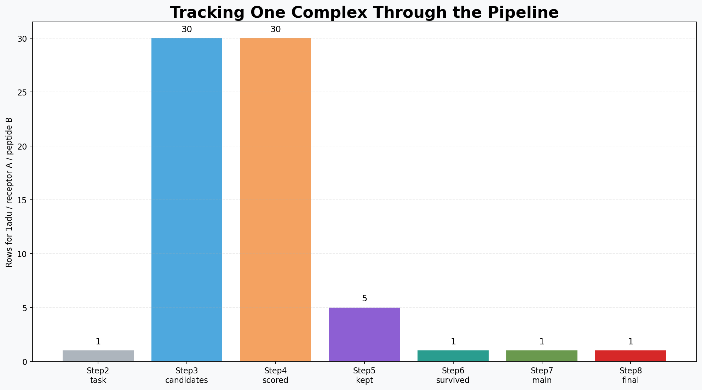
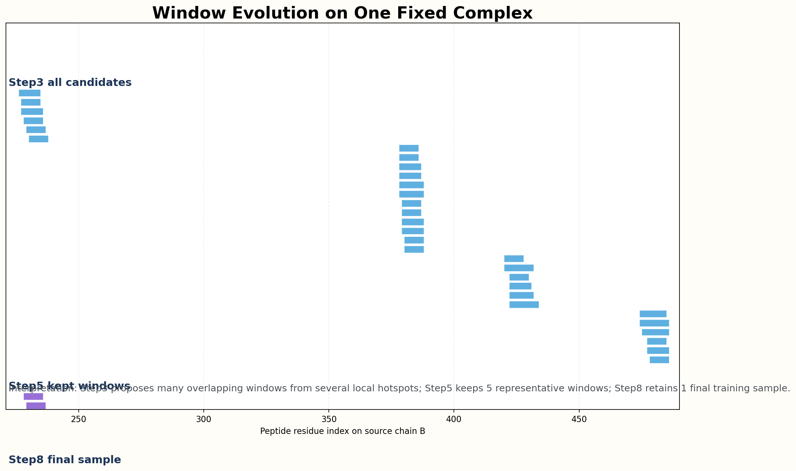
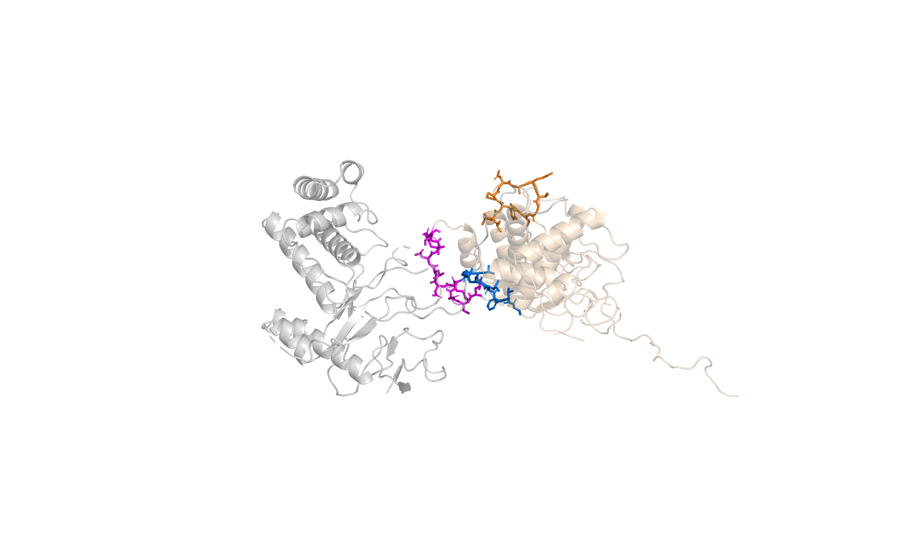
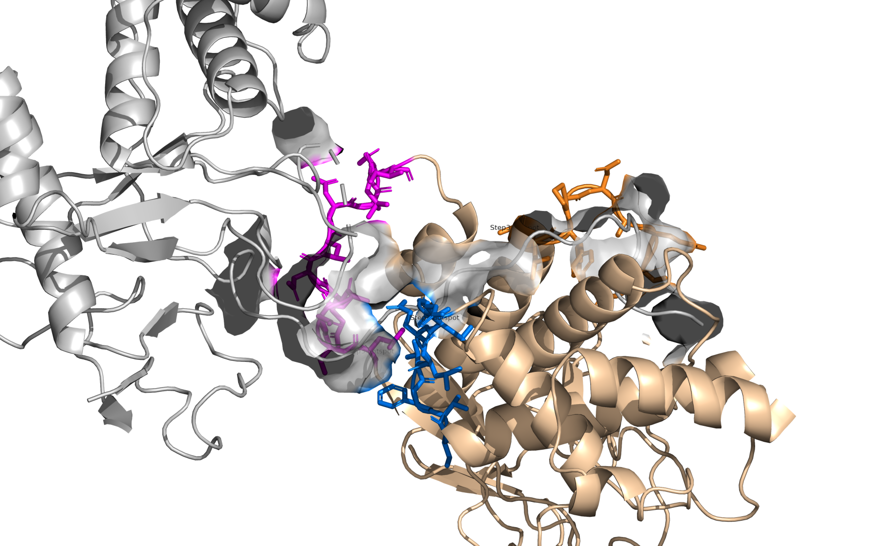
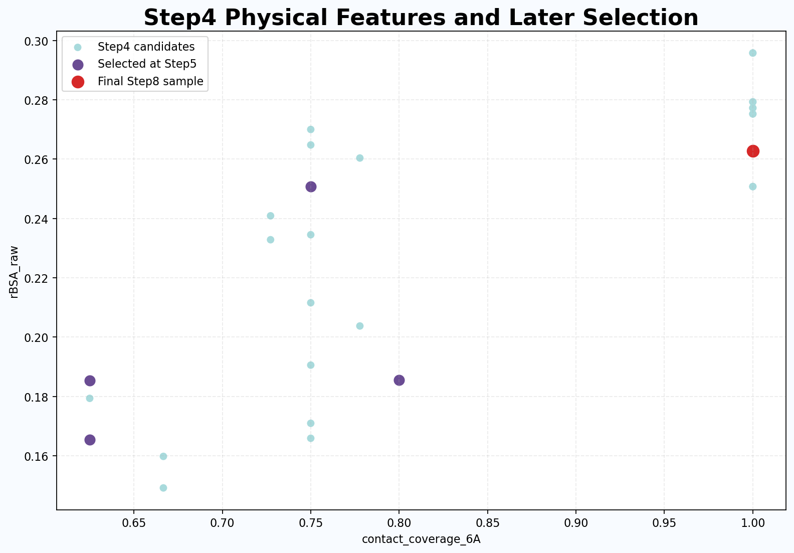
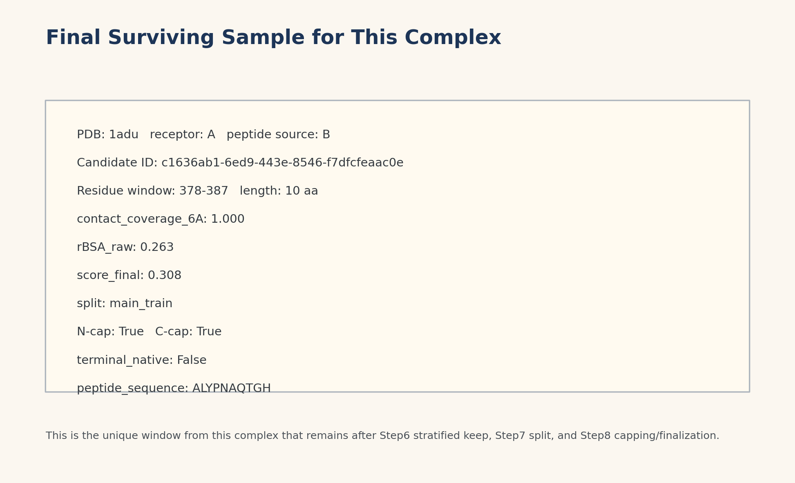
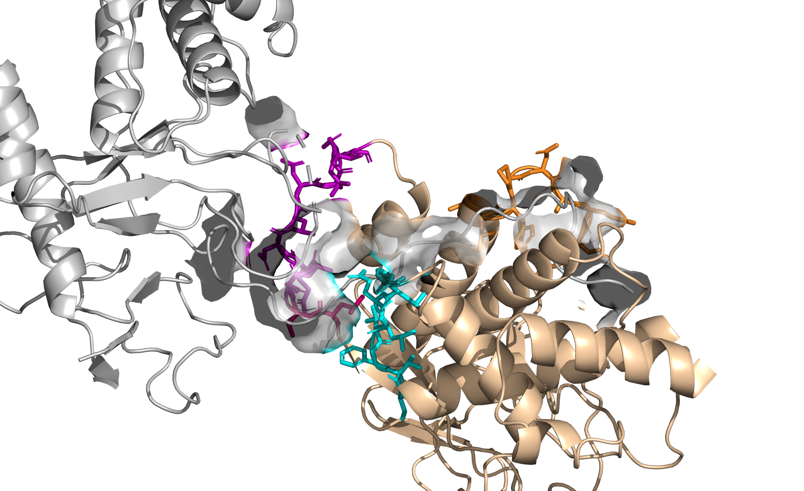
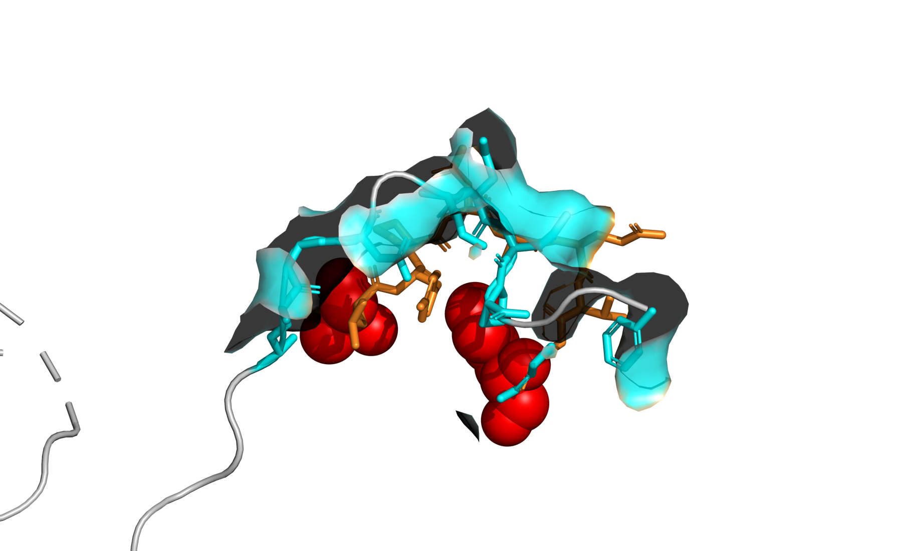

# 单一复合物全流程追踪

固定案例：`1adu / receptor A / peptide source B`

- 这页汇报不再讲整体数据集，而是只追踪一个复合物
- 目的是让老师直观看到：一个复合物如何从原始任务逐步变成最终训练样本
- 当前基于 `project/runs/smoke_server`

# 案例背景

- Step2 中该复合物对应 1 个有向任务
- `parent_task_id = 0a793145-4871-547f-be67-b5e029600c00`
- 受体链 A，来源肽链 B
- source chain 上存在多个可切片热点，因此很适合做流程追踪

# 单个复合物的行数变化

{ width=88% }

- Step3 生成 30 个候选窗口
- Step5 保留 5 个代表窗口
- Step6 以后只剩 1 个最终样本

# 窗口是如何收缩的

{ width=95% }

- Step3 在同一条 source chain 上提出大量重叠窗口
- Step5 把这些窗口压缩成 5 个代表候选
- Step8 最终只保留 1 个样本进入训练元数据

Step3 高频窗口示例：378-387 (2), 379-387 (2), 378-386 (2), 380-387 (2), 379-386 (2)

# PyMOL 总览

{ width=92% }

- 灰色是 receptor chain A
- 浅棕色是 peptide source chain B
- 用颜色标出的 3 个区域对应这个复合物在 Step3 中最明显的切片热点

# PyMOL：Step3 热点

{ width=92% }

- 这里展示的是 Step3 候选窗口集中出现的 3 个热点区
- 可以直观看到这些热点都贴着受体表面，而不是链上随机位置
- 这页适合讲“锚点驱动的候选生成”

# Step4 打分如何影响后续选择

{ width=82% }

- 横轴是 `contact_coverage_6A`
- 纵轴是 `rBSA_raw`
- 紫色点是 Step5 选中的窗口，红点是最后进入 Step8 的样本

# 最终保留下来的样本

{ width=92% }

- 最终窗口：378-387
- 长度：10 aa
- split：main_train
- `has_n_cap = True`，`has_c_cap = True`

# PyMOL：Step5 到 Step8

{ width=92% }

- 这页展示 Step5 最终保留的 5 个窗口
- 可以看出它们来自 3 个局部区域，而不是完全重合的克隆窗口

# PyMOL：最终样本

{ width=92% }

- 最后进入 Step8 的就是橙色这段 `378-387`
- 青色是最终局部 pocket，红色球标记窗口两端
- 这一页最适合讲“最终训练样本长什么样”

# 可视化结构文件

- PyMOL 截图已生成：`pymol_full_complex.png`、`pymol_step3_hotspots.png`、`pymol_step5_windows.png`、`pymol_step8_final.png`
- 结构导出状态：本次会话未成功导出可复用的 overlay PDB
- 说明：当前会话中 WSL 结构导出被系统拒绝，但不影响 PyMOL 直接读取 `1adu.cif` 生成截图
- 如果导出成功，可在 `pdb_exports/` 下继续用 PyMOL/Chimera 截图补充到 PPT

# 这个案例能说明什么

- 同一个复合物在 Step3 会出现大量重叠候选
- Step5 先做去冗余和带权采样，留下少量代表窗口
- Step6 到 Step8 再结合分层保留、split 和封端，最终变成真正可训练的单条样本
- 用一个固定复合物跟踪，比只看总统计更能解释流程的行为逻辑
