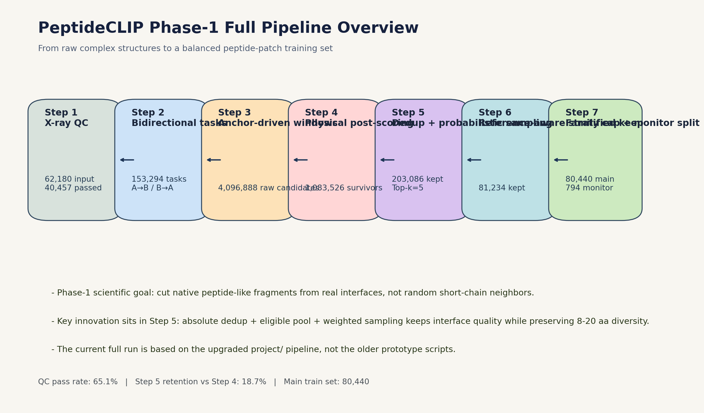
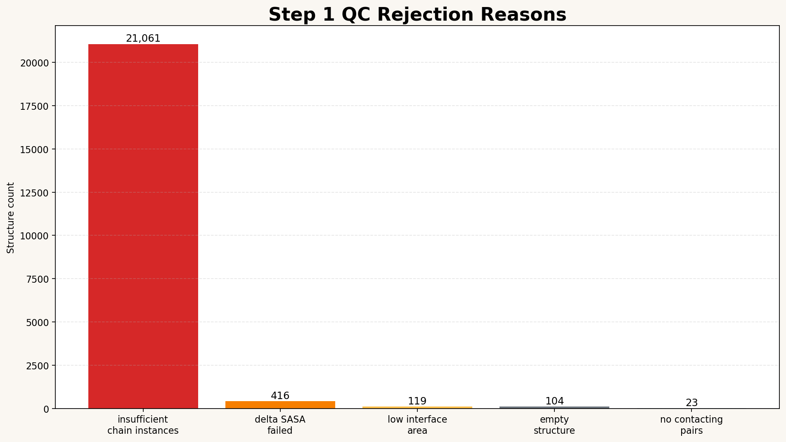
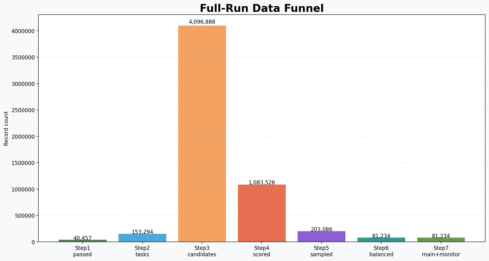
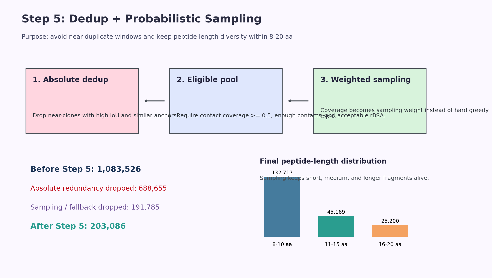
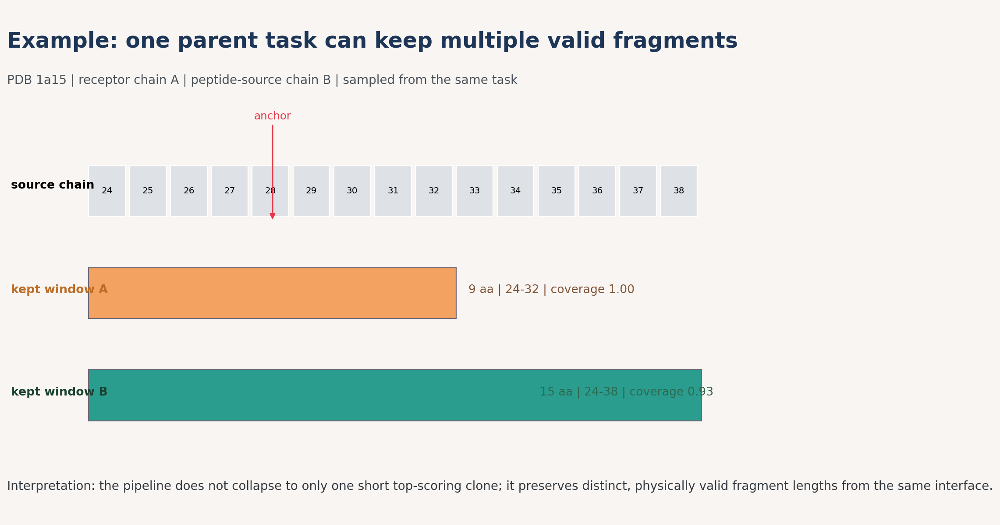

# PeptideCLIP 阶段一

高保真 Peptide-Patch 数据底座构建

- 目标：从真实蛋白复合物界面中切出可训练的 peptide-patch 片段
- 核心问题：切到的是“受体主导的界面片段”，而不是原链邻域的随机短截段
- 当前汇报基于 `project/` 下升级版全流程与 `project/runs/full_run`

# 研究目标

要解决的不是“怎么把链剪短”，而是三件事：

- 先筛掉结构质量差、界面不可靠的复合物
- 再围绕真实接触锚点生成候选片段
- 最后在保证物理合理性的同时，保留长度多样性和家族分布平衡

这套流程最终服务于后续模型训练所需的主训练集与 monitor 集。

# 全流程总览

{ width=95% }

# Step 1 结构质控

{ width=78% }

- 输入复合物：62,180
- 通过质控：40,457，通过率 65.1%
- 最大拦截原因：`insufficient_chain_instances`，说明很多结构天然不满足后续双向切片需求

# 数据漏斗

{ width=88% }

- Step 2 把通过质控的复合物展开为 153,294 个双向任务
- Step 3 由真实接触锚点扩展出 4,096,888 个原始候选窗口
- Step 4 用 rBSA、contact coverage、patch size 等物理特征把候选收缩到 1,083,526

# Step 5 核心创新

{ width=93% }

- Step 5 前输入：1,083,526
- 绝对冗余去除：688,655
- 最终保留：203,086
- 长度分布：8-10 aa 132,717；11-15 aa 45,169；16-20 aa 25,200

# 真实切片案例

{ width=90% }

- 同一个 parent task 可以保留多个“不是同一个克隆”的有效片段
- 示例任务来自 `1a15 / B_as_peptide__A_as_receptor`
- 样例短片段：24-32，长度 9 aa，coverage=1.00
- 样例长片段：24-38，长度 15 aa，coverage=0.93

# 阶段一后半程的平衡化处理

- Step 6：参考真实分布做分层保留，从 203,086 压到 81,234
- Step 6C：在不打破 family cap 的前提下再次重对齐，主集合保留 58,641
- Step 7：家族上限 + monitor split，得到 main 80,440 / monitor 794

当前 monitor 占比约 0.98%。

# 最终产出 Step 8

- Step 8 成功写出样本：59,435，错误数 0
- split 结果：main_train 58,641；monitor 794
- 采样来源：sampling 59,245；fallback 190
- 端点情况：天然末端 9,917，占比 16.7%
- 封端覆盖：N cap 54,164 (91.1%)；C cap 52,795 (88.8%)

# 目前结果

- 全流程已经从“切片”走到了“可训练数据集组织”
- 当前最终可用样本数：59,435
- 其中主训练集 58,641，monitor 集 794
- 主集合 peptide 长度中位数：12 aa
- 主集合 patch 大小中位数：19
- 主集合 rBSA 中位数：0.338

# 可以向老师强调的点

- 这不是简单切肽，而是“以真实界面锚点为中心”的片段生成
- Step 5 没有采用死板 greedy Top-k，而是用了“先去冗余，再按接触密度带权抽样”
- 后续又做了参考分布对齐、family cap 和 monitor split，数据集更适合训练与评估
- 整体上，阶段一已经形成了从结构质控到训练样本组织的完整闭环
