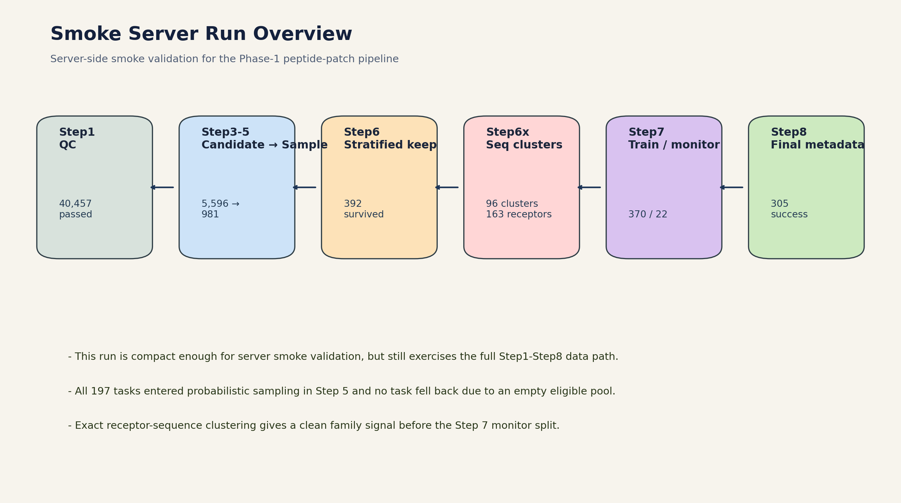
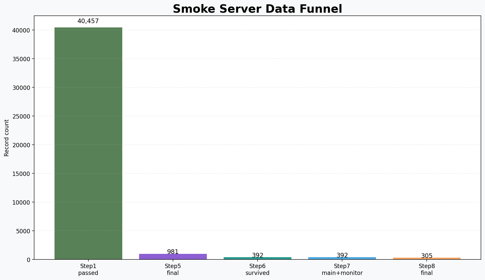
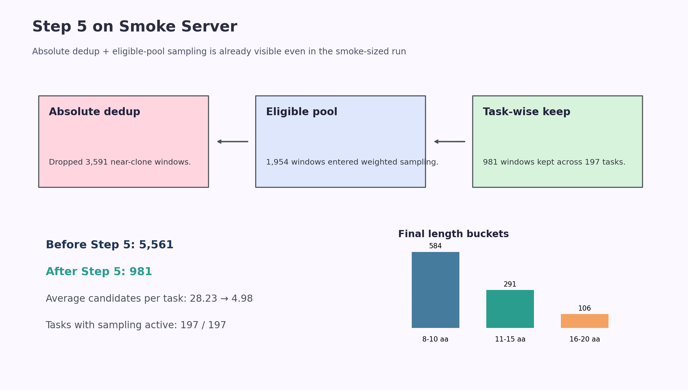
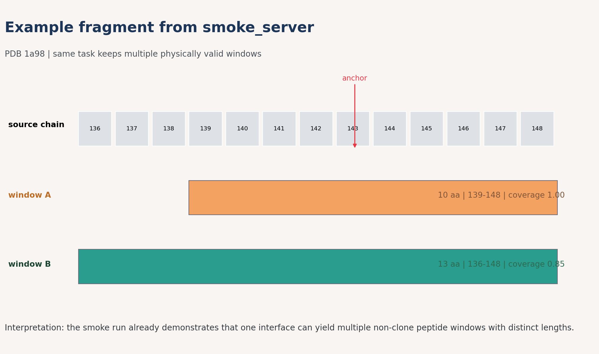
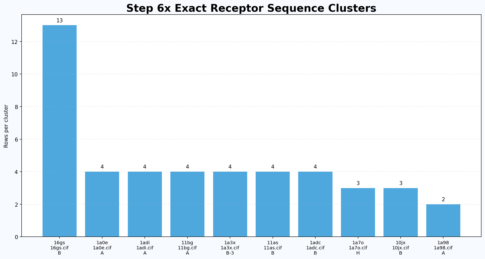

# smoke_server 运行结果汇报

PeptideCLIP Phase-1 服务器 smoke 验证

- 目的：确认升级版全流程在服务器环境下能完整跑通
- 范围：Step1 到 Step8 全链路，包括 Step6x 序列聚类
- 重点：不是追求最大规模，而是验证流程完整性、统计合理性和最终落盘成功

# 本次 run 的意义

- 它是一套小规模但完整的服务器 smoke run
- 能证明从候选切片到最终 metadata/lmdb 的整条链路已经闭环
- 也能提前暴露 Step5 采样、Step6 平衡、Step7 分组拆分、Step8 封端落盘是否稳定

# 全流程总览

{ width=95% }

# 数据漏斗

{ width=85% }

- Step 1 通过质控：40,457
- Step 5 保留候选：981
- Step 6 分层保留后：392
- Step 8 最终写出：305

# Step 5 关键机制

{ width=92% }

- 原始输入候选：5,561
- 绝对冗余去除：3,591
- Top-k / sampling 后继续收缩：989
- 最终任务数：197，所有任务都进入了 sampling

# 真实切片案例

{ width=90% }

- 示例来自 `1a98 / A-2_as_peptide__A_as_receptor`
- 片段 A：139-148，长度 10 aa
- 片段 B：136-148，长度 13 aa
- 说明同一个界面任务不会只剩一个机械式短肽克隆

# Step 6x 序列聚类

{ width=88% }

- exact 模式下共有受体序列 163 条
- 聚成 96 个 cluster
- 最大 cluster 只有 13 条，说明 smoke run 的家族结构还比较可控

# Step 7 / Step 8 最终结果

- Step 7：main_train 370，monitor 22
- Step 7 monitor 实际比例 5.61%
- Step 8：成功写出 305 条，错误数 0
- Step 8 terminal native 占比 13.4%
- Step 8 N-cap 覆盖 93.1%；C-cap 覆盖 87.9%

# 可以向老师强调的点

- 服务器 smoke run 已经证明全流程能稳定落到 Step 8
- Step 5 的“去冗余 + 概率抽样”在小规模 run 上也能观察到明显效果
- Step 6x 额外提供了受体序列聚类视角，便于后续 family-aware 控制
- 最终已经不是中间候选文件，而是真正可用于训练的数据元信息输出

# 下一步建议

- 在服务器上扩大任务规模，观察 Step 6 到 Step 8 的统计是否保持稳定
- 挑 2 到 3 个代表性复合物做结构可视化截图，补一页更直观的案例展示
- 如果准备正式组会，再把这版 smoke 汇报和 full_run 汇报拼成“验证版 + 正式版”双层结构
